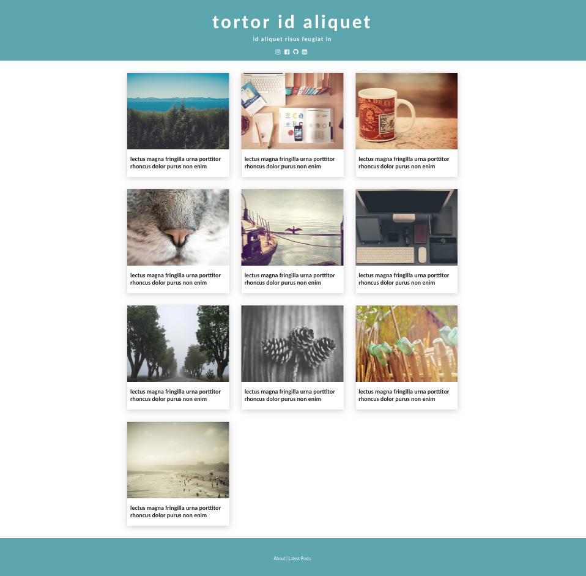

<p align="center">
  
</p>

This project was bootstrapped with [Create Next App](https://github.com/zeit/next.js).

It provides a template that fetches the data from an external source and thus preventing a new build each time a new post is created.

It also provides Server Side Rendering (SSR) that enhances Search Engine Optimization (SEO).

## Instructions

This project needs an environment variable called `API_URL`, which represents the address containing the data that feeds the template.

Example: `http://localhost:3001`

The address should expose the following resources that respond to `GET` requests with the following structures:

- `/posts`:

```
[
  {
    "title": "",
    "thumbnailImage": "",
    "article": "",
    "id": <number>
  }
]
```

- `/about`:

```
{
  "article": ""
}
```

- `/header`:

```
{
  "bigTitle": "",
  "smallTitle": "",
  "media": [
    {
      "name": "",
      "url": ""
    }
  ]
}
```

**Note:** At the moment the (social) media supported is: `instagram`, `facebook`, `github` and `linkedin`.

- `/meta`:

```
{
  "title": "",
  "description": "",
  "url": "",
  "ogImage": ""
}
```

Run with:

```
npm run build
npm start
```
